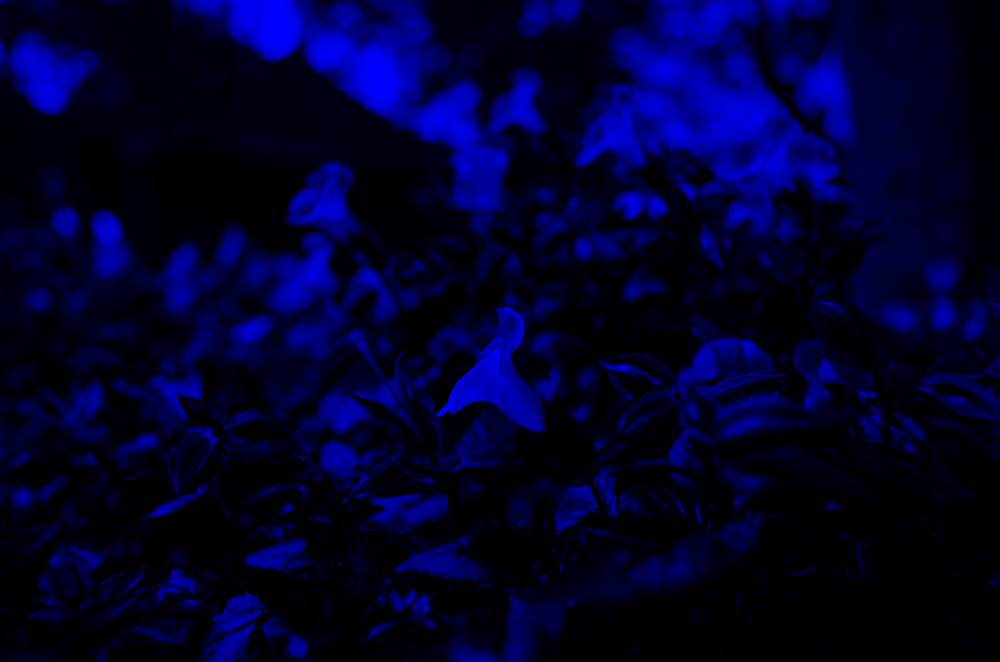
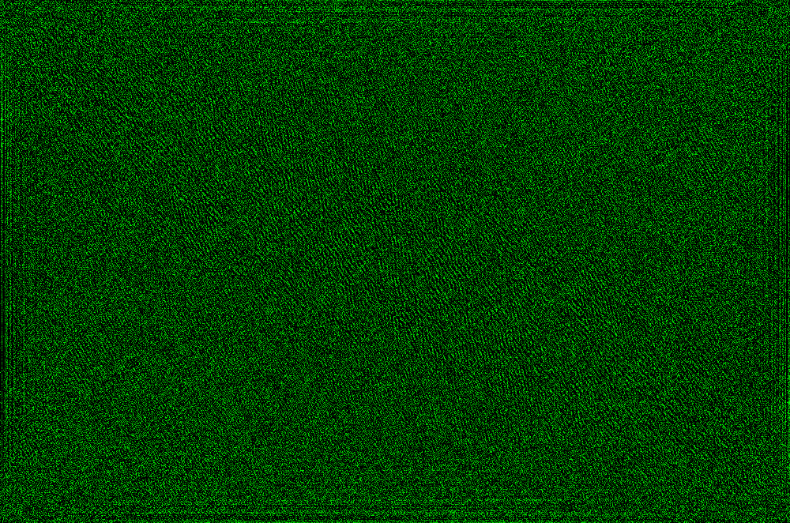
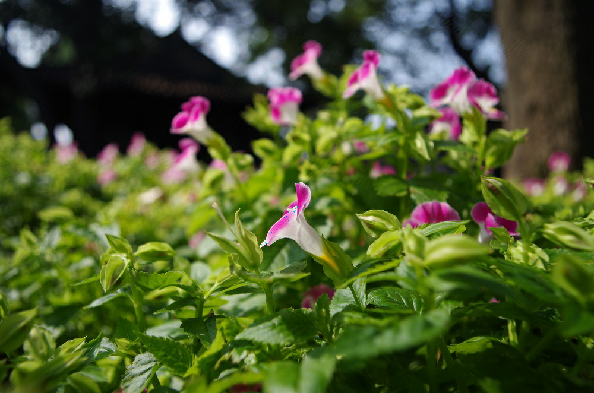

# Introduction
Image watermark prototype tool with cuFFT APIs and cuda code. 

The template is from [Pascale's course](https://github.com/PascaleCourseraCourses/CUDAatScaleForTheEnterpriseCourseProjectTemplate) and code structure from [CUDA Samples](https://github.com/nvidia/cuda-samples)
. Go to https://docs.nvidia.com/cuda/cufft/ for more documentation on cuFFT APIs.

## Project Technical Description

In order to add watermark to the image, we'll do the following steps. 
- Read image
- Split image into 3 channels (RGB)
- For each channel, FFT forward.
- In FFT images, add watermark using CUDA kernels to it.
- Convert back from FFT watermarked images to normal channels (RGB).
- Merge the channel and calculate difference.

You can also have steps with images below:


| Steps             |  Images |
:-------------------------:|:-------------------------:
Loading image |  
Split image into RGB channels |    
FFT each channel |    
Watermark on FFT channels |    
Reverse on the watermarked channels |    
Merge RGB into new images |  


**Can you spot the difference?** These two images are nearly identical and only a small difference between watermarked image and the original image. For example, you can check the flower's petal in the center, which you'll find some blue-ish dots in the watermarked image.


## How to compile & run
Before run the code and compile the code, please make sure FreeImage dependency has already installed. Then you can easily compile and run the program using following script:

```
./run.sh
```
Just execute the above, it will compile and run the program, it will output the log and save every steps into seperate images! I'll excerpt part of the logs here:

``` Text
==== Dealing with image flower.jpg ====
        Step 1: get the filename and load into image.
        Step 2: split the image into channels, save for each file.
        Step 3: make the data onto GPU.
        Step 4: Make FFT.
        Step 5. for each ffted channel, add watermark to the corners.
        Step 6. for each channel, do iFFT, into normal space.
        Step 7. Combine 3 channels into one.
        Step 7.1  Save into RGB file.
        Step 8. Compare initial image and watermarked image.
Compare result: Two image max diff 255 , average err per pixel 1.95759
```

The code is tested on [NVIDIA Jetson TX2 platform](https://developer.nvidia.com/embedded/jetson-tx2), which has 6 ARM cores as well as 256-core NVIDIA Pascal(TM) GPU.

## Code Organization

```bin/```
This folder should hold all binary/executable code that is built automatically or manually. Executable code should have use the .exe extension or programming language-specific extension.

Note that I included the binary of ARM, which is supposed to run on NVIDIA Jetson TX2 platform(GPU arch sm_62). If you have other platform, please re-build the program by running `run.sh`

```data/```
This folder contains sample input and sample output. In my experiments, `"color.png", "flower.jpg", "sloth.png"` are the input images. Other images are generated from program. If you want to customize, add more pictures and change the code in `cudaWatermark.cpp`.

```lib/```
Contains libraries that copied from original template repo. It contains GL, UtilNPP, and various helper headers.

Notice that you might need FreeImage placed in the folder if you do not have FreeImage installed on the system.

```src/``` Source code folder.
- `cudaWatermark.cpp` the main file that contains main program logic.
- `fileio.cpp` and `fileio.h` contains image read/write functions and image type convert functions.
- `wmKernel.cu` and `wmKernel.cuh` contains the cuda kernel that do the watermark and scaling steps. You can also try different setting or even different kernels by modifying `applyKernel`.

```README.md```
This documentation.

```INSTALL```
The installation dependency library description of this repo.

```Makefile or CMAkeLists.txt or build.sh```
Makefile is used for making this project. You can build the binary simply by `make build`.

```run.sh```
This script is for easy hands-on. It will cleanup existing binaries and compile from scratch, then it will run the program. 
The script will drop the debug info. If you want to see the debug info, please modify `run.sh` and remove `2>/dev/null`


# Misc

The code from NVIDIA has its own license, please check the specific license file or the header of each file.

The flower image is taken by DC-Shi and can be only used for this cudaWaterMarkSample project. Others images are searched from internet.
